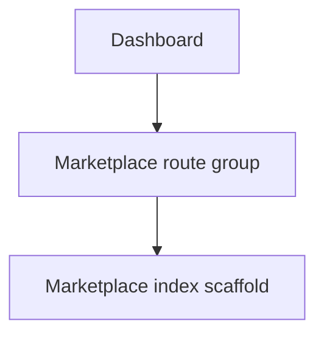

# Plan: Dashboard Sections Hub + Marketplace Experience

## Goal

Make [`src/routes/dashboard/index.tsx`](src/routes/dashboard/index.tsx:1) a durable navigation hub that can route users into multiple distinct experiences (sections) inside the same app.

First section to add: a top-level, authenticated Marketplace experience at `/marketplace` with its own layout and visual design (separate from the dashboard layout defined in [`src/routes/dashboard.tsx`](src/routes/dashboard.tsx:1)).

## Non-goals (for v1)

- Payments, checkout, shipping, messaging
- Advanced moderation workflows
- Full-text search

## Proposed UX

### Dashboard

Primary navigation to experiences should be **horizontal** (inspired by the eBay-style category bar):

- A horizontal “Experiences” bar near the top of the dashboard content area.
- Each experience is a tab/pill/button (e.g. Marketplace, Analytics, Support, etc.).
- Active experience is visually highlighted (underline or pill background).
- Overflow behavior: horizontal scroll on smaller viewports.

Optionally (if you want richer discoverability), below the bar you can still include a grid/list of “section cards” that mirrors the same destinations.

Initial experiences to show:

- Marketplace
- Future sections (placeholder)

Clicking Marketplace navigates to `/marketplace`.

### Marketplace

- Marketplace landing page is a **scaffold** page that proves:
  - the route group exists
  - auth is enforced
  - the Marketplace layout/design can diverge from the Dashboard
  - the app can be extended with additional “experiences” later

For this groundwork version, the Marketplace page can simply show placeholder content like “Marketplace (Scaffold)” plus a short paragraph describing what will live here in a specialized version.

#### Marketplace navigation (eBay-style inspiration)

From the screenshot inspiration, the key UX pattern to replicate at a smaller scale:

- A **horizontal category nav bar** below the Marketplace header area.
- Categories are simple clickable labels (e.g. “All”, “Electronics”, “Home”, etc.).
- Active category is highlighted.
- On mobile, the category list becomes horizontally scrollable.

In the scaffolding phase, these categories can be static UI-only (no data filtering yet). The goal is to establish the “experience shell” pattern.

## Routing + Layout Design

Use a top-level route group so Marketplace can have a different layout and styling:

- `src/routes/marketplace/_route.tsx`  
  Marketplace layout (header, container, optional filters sidebar) and auth guard.
- `src/routes/marketplace/index.tsx`  
  Browse items

For this scaffolding phase, we intentionally **do not** create additional Marketplace subroutes yet.

### Why `marketplace/_route.tsx` instead of `marketplace.tsx`?

Both patterns can work in TanStack Router.

- **Folder layout (`marketplace/_route.tsx`)** is the most explicit “route group layout” convention. It cleanly supports multiple pages (index, new, details) without path conflicts.
- **Single-file parent route (`marketplace.tsx`)** can also act as a layout *if* it renders an `<Outlet />` and you define child routes with the dot convention (e.g. `marketplace.new.tsx`, `marketplace.items.$itemId.tsx`). The tradeoff is that your `/marketplace` index content typically lives in `marketplace.tsx` itself (you generally would not also create `marketplace/index.tsx`, because that would collide conceptually with the same path).

This plan uses the folder layout approach so the Marketplace index page can be its own file (`marketplace/index.tsx`) while still having a shared Marketplace shell.

Auth enforcement options:

- Prefer `beforeLoad` on `marketplace/_route.tsx` to redirect to `/login` if unauthenticated.
- Server functions must also validate user (defense in depth).

Mermaid routing view:

## Deferred (Data Model + Server Functions)

Because this is a scaffolding app meant to support many future experiences, we defer Marketplace-specific persistence until the Marketplace becomes a real, specialized experience.

When you decide to specialize into a real Marketplace, we can add:

- A Drizzle table for items
- Server functions for list/get/create
- Marketplace subroutes (new/details)

## UI Components

Re-use existing UI primitives:

- [`src/components/ui/button.tsx`](src/components/ui/button.tsx:1)
- [`src/components/ui/card.tsx`](src/components/ui/card.tsx:1)
- [`src/components/ui/input.tsx`](src/components/ui/input.tsx:1)

Marketplace pages can have their own look while still using these primitives (layout + composition drives design).

## Implementation Notes (shadcn/ui + Tailwind)

This repo already uses shadcn/ui-style primitives + Tailwind utility classes. The horizontal navigation can be built with **no new dependencies** by composing:

### Dashboard “Experiences” horizontal nav

- Render an array of experiences.
- Use [`Button()`](src/components/ui/button.tsx:39) with `asChild` so the clickable element is a `<Link>`.
- Use Tailwind for horizontal scroll and active state:

Suggested Tailwind structure:

- Container: `flex gap-2 overflow-x-auto whitespace-nowrap pb-2 -mx-1 px-1`
- Items: `shrink-0`
- Active: `bg-accent text-accent-foreground` (matching existing patterns)

### Marketplace “Category bar” (eBay-style)

- Similar pattern: a horizontal list of category links/buttons.
- For scaffold phase: categories can be static and set active state locally (or via search params later).
- Tailwind: `border-b`, `text-sm`, and active underline or pill background.

### Use Router state for “active” styling

- Read the current path from router state and apply active classes.
- In dashboard, highlight the active experience (e.g. `/marketplace` tab is active when the user is in the Marketplace route group).

This keeps the “scaffold app” flexible while remaining consistent with the project’s existing shadcn/ui primitives and Tailwind styling.

## Implementation Steps (numbered, documentation-first)

### 1. Define section registry

Create a lightweight registry that the dashboard can render:

- Example: `src/lib/sections.ts` exports an array of sections: key, title, description, to, requiresAuth

### 2. Update Dashboard hub UI

Update [`src/routes/dashboard/index.tsx`](src/routes/dashboard/index.tsx:1) to render cards/buttons from the section registry.

- Use `<Link>` or `useNavigate` to go to `/marketplace`
- Ensure button affordance and consistency (pointer cursor already handled by Button)

### 3. Add Marketplace route group + layout

Create `src/routes/marketplace/_route.tsx` with:

- `beforeLoad` auth guard (redirect to `/login`)
- Marketplace-specific shell layout (header, container, filters placeholder)

### 4. Add Marketplace pages

- `src/routes/marketplace/index.tsx` scaffold page (placeholder content)

### 5. Update documentation

- Add a line to [`docs/CHANGELOG.md`](docs/CHANGELOG.md:1)
- Optional: update [`docs/PROJECT_SUMMARY.md`](docs/PROJECT_SUMMARY.md:1) with new section concept

## Future Extensibility

This pattern supports multiple “experiences” by:

- Adding entries to the section registry
- Adding a new top-level route group per experience for isolated design
- Applying consistent auth/role policies

